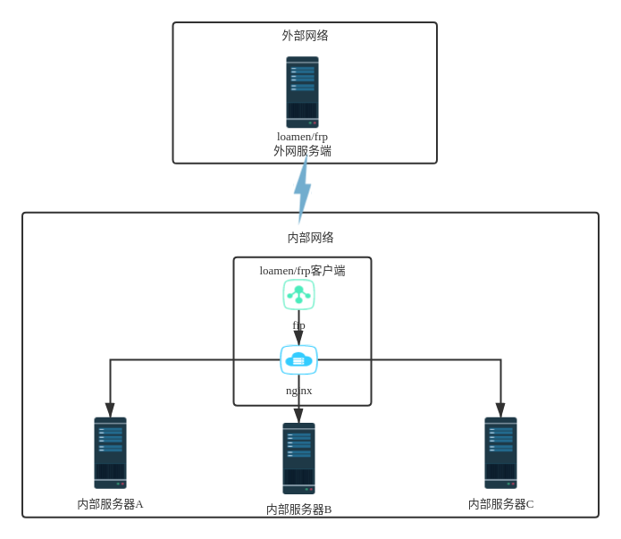

## 1.Frp简介

  frp 是一个专注于内网穿透的高性能的反向代理应用，支持 TCP、UDP、HTTP、HTTPS 等多种协议。可以将内网服务以安全、便捷的方式通过具有公网 IP 节点的中转暴露到公网。
  docker frp提供frps和frpc容器版本，并自带nginx，用于frpc穿透指向到不同服务器。

应用场景：将内网多台服务器映射到外网。




## 2.获取docker frp

获取docker frp

> $ docker pull  loamen/frp:0.44.0


## 3.目录结构

```
/opt/frp/
|-- LICENSE
|-- conf                     #配置目录，可挂载
|   |-- frpc.ini
|   |-- frpc_full.ini
|   |-- frps.ini
|   `-- frps_full.ini
|-- frpc
|-- logs                     #日志目录，可挂载
|-- start_frp.sh             #启动脚本
`-- systemd
    |-- frpc.service
    |-- frpc@.service
    |-- frps.service
    `-- frps@.service
```


## 4.Nginx配置

​	nginx配置请参考官方文档：https://hub.docker.com/_/nginx


## 5.运行

获取docker frp
> docker pull loamen/frp:0.37.1

基本运行
> $ docker run --privileged=true --name loamen-frp -d loamen/frp:0.37.1

挂载ngxin目录
```
docker run --privileged=true --name loamen-frp \
	-v /host/path/nginx/html:/usr/share/nginx/html \
	-v /host/path/nginx/conf:/etc/nginx/conf.d \
	-d loamen/frp:0.37.1
```

挂载frp目录
```
docker run --privileged=true --name loamen-frp \
	-v /host/path/frp/conf:/opt/frp/conf \
	-v /host/path/frp/logs:/opt/frp/logs \
	-d loamen/frp:0.37.1
```

挂载nginx和frp目录
```
docker run --privileged=true --name loamen-frp \
	-v /host/path/nginx/html:/usr/share/nginx/html \
	-v /host/path/nginx/conf:/etc/nginx/conf.d \
	-v /host/path/frp/conf:/opt/frp/conf \
	-v /host/path/frp/logs:/opt/frp/logs \
	-d loamen/frp:0.37.1
```

设置环境变量，启动类型`FRP_TYPE`：`client`为客户端模式，`server`为服务端模式
```
docker run --privileged=true --name loamen-frp \
	--env FRP_TYPE=client
	-d loamen/frp:0.37.1
```

暴露端口
```
docker run --privileged=true --name loamen-frp \
	-p 80:80 \
	-p 9000:9000 \
	-p 7000:7000 \
	-d loamen/frp:0.37.1
```

全部设置

```
docker run --privileged=true --name loamen-frp \
	--env FRP_TYPE=client \
	-p 80:80 \
	-p 9000:9000 \
	-p 7000:7000 \
	-v /host/path/nginx/html:/usr/share/nginx/html \
	-v /host/path/nginx/conf:/etc/nginx/conf.d \
	-v /host/path/frp/conf:/opt/frp/conf \
	-v /host/path/frp/logs:/opt/frp/logs \
	-d loamen/frp:0.37.1
```
docker启动后，可打开浏览器`http://loacalhost:80`查看，如果`80`端口被占用，请映射其他端口。

## 6.示例

如：内网服务A（`192.168.0.101:8001`）、内网服务B（`192.168.0.102:8002`）、内网服务C（`192.168.0.103:8003`）
Nginx转发配置（`default.conf`）如下：
```
server {
    listen       8001;
    server_name  localhost;


    location / {
		proxy_pass http://192.168.0.101:8001/;
		proxy_set_header Host $host:$server_port;
	}
}

server {
    listen       8002;
    server_name  localhost;


    location / {
		proxy_pass http://192.168.0.102:8002/;
		proxy_set_header Host $host:$server_port;
	}
}

server {
    listen       8003;
    server_name  localhost;


    location / {
		proxy_pass http://192.168.0.103:8003/;
		proxy_set_header Host $host:$server_port;
	}
}
```

frp客户端配置（`frpc.ini`）如下

```
[web_a]
type = http
local_port = 8001
custom_domains = a.loamen.com

[web_b]
type = http
local_port = 8002
custom_domains = b.loamen.com

[web_c]
type = http
local_port = 8003
custom_domains = c.loamen.com
```


##### 注意：由于docker进程限制，需要进入容器手动执行`./start_frp.sh`或`bash start_frp.sh`